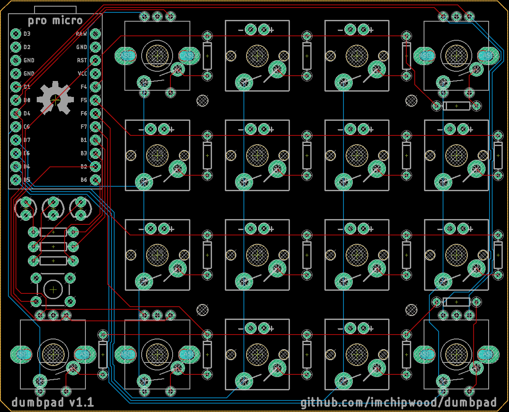

# dumbpad

dumbpad is a simple 4x4 macro/numpad with a rotary encoder. It is designed for the ATmega32u4-based Pro Micro running [QMK firmware](https://github.com/qmk/qmk_firmware).

The EC11 rotary encoder used has a push-button, which technically makes this a 17-switch macro/numpad. The default behavior of the rotary encoder is to move the mouse left/right - the intention is to be used on slider-type controls such as brightness, RGB values, etc. found in video/photo editing software.

## Parts
* 16x Cherry-style mechanical switches
* 17x diodes (SOD-123 package)
* 6x 20Kohm resistors (0603 package)
* 2x 0.1uF capacitors (0603 package)
* 1x 1.0uF capacitor (0603 package)
* 1x Pro Micro ATmega32u4
* 1x EC11 rotary encoder (7-pin)
* 1x IS31FL3731 I2C LED driver (SSOP package)
* 16x 3mm or 5mm LEDs (thru hole)
* (optional) 1x 6mm tactile switch (to reset MCU - QMK reset keycode or bootmagic can be used instead)

## Making the PCB
https://www.oshpark.com is the recommended service for creating PCBs. 3x PCBs is roughly $60 from them. Simply upload the .brd file to create the project and order.

All capacitors, resistors, diodes, and the LED driver in this version are surface mount - it isn't too difficult to solder them by hand but reflow soldering is easy if you have an oven (making one out of an old toaster oven is pretty easy). Order a stencil through [OSH Stencils](https://www.oshstencils.com/) to make applying paste easier.
