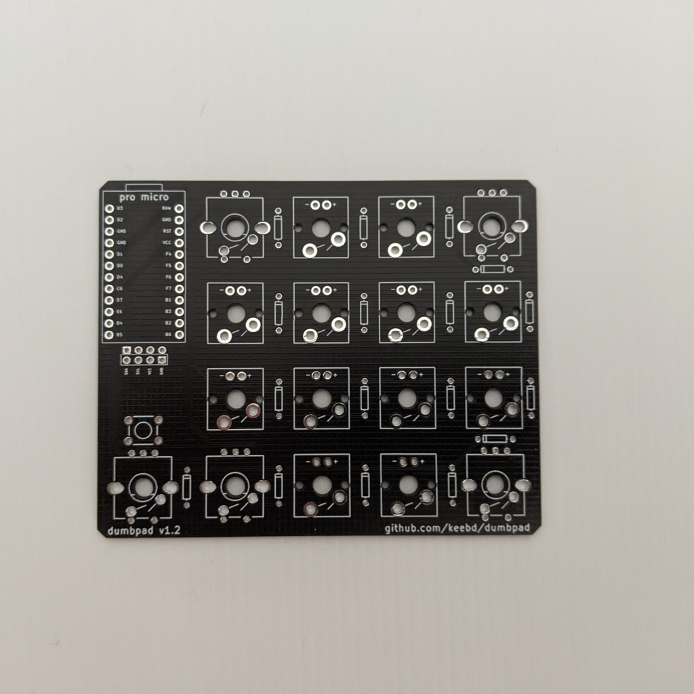
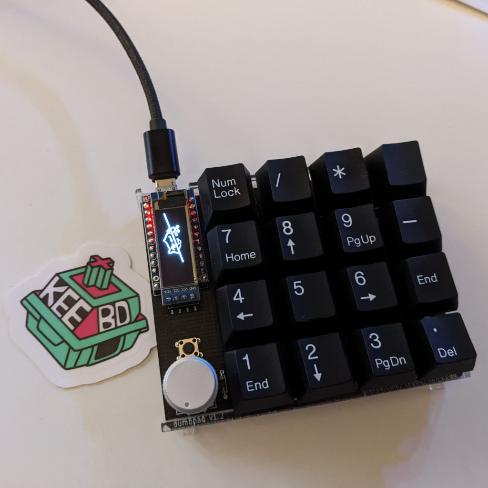
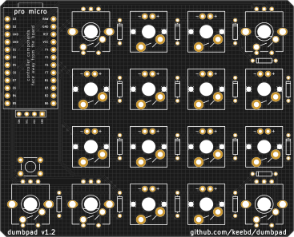
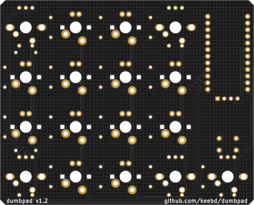

# dumbpad - OLED (aka v1.2)

Designed by [KEEBD](https://www.keebd.com).

## Description

Version of the original dumbpad but with support for an OLED display in place of the LED's and resistors.

### Revisions

- 1.2 Initial published PCB

#### dumbpad v1.2

#### Renders

### Bill of materials
- 1 x PCB
- 16 x MX-style mechanical switches
- 17 x 1n4148 diodes (thru hole)
- 1 x Arduino Pro Micro or pin-compatible ATmega32u4-based MCU (Or teensy for the teensy version)
- 1 x or 2x EC11 rotary encoder with pushbutton (7-pin)
- 1 x 6mm tactile switch (to reset MCU)
- 1 x 0.91" 128X32 OLED Display

## OLED Firmware

The OLED firmware is different and can be found here [Firmware](https://docs.keebd.com/firmware/)

## How to build 
You can follow the instreuctions from the main [readme](https://github.com/imchipwood/dumbpad#getting-started) or follow the instructiosn in this [blog](https://www.timowielink.com/post/how-to-build-a-macropad) from [Timo Wielink](https://github.com/TimoWielink)
