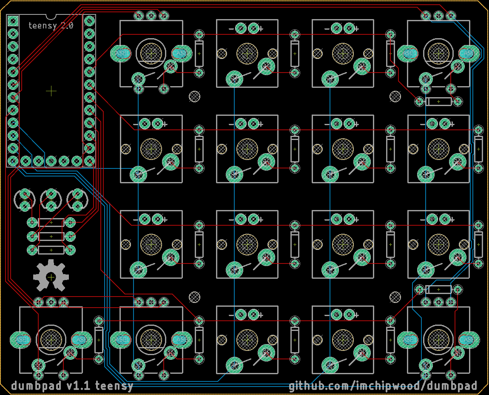

# dumbpad teensy
Designed by [imchipwood](https://www.github.com/imchipwood) in Portland, Oregon, USA

Special thanks to [QMK](https://www.qmk.fm) for open-source keyboard firmware

## v0.6_dualencoder by chicocode

## Eagle PCB render

## Description

dumbpad is a simple 4x4 numpad/macropad with rotary encoder support.
Version 1.1 uses combined Cherry MX switch & EC11 rotary encoder sockets so a single PCB now supports both single- and dual-encoder layouts.

dumbpad is designed to run [QMK firmware](https://github.com/qmk/qmk_firmware) - check [qmk_firmware/keyboards/dumbpad](https://github.com/qmk/qmk_firmware/tree/master/keyboards/dumbpad) for compiling & uploading instructions.

## v1.x features

### Status Indicator LEDs

There are three status indicator LEDs near the Teensy microcontroller

- The right two are for indicating which layer is enabled, supporting up to four layers via binary representation (00, 01, 10, 11)
- The left LED indicates if numlock is enabled

Changing the behavior of the LEDs is simple - look at [v1x.c](https://github.com/imchipwood/qmk_firmware/blob/dumbpad_refactor/keyboards/dumbpad/v1x/v1x.c) for guidance.

### Single- vs Dual-Encoder Support

With the combined Cherry MX/encoder sockets, allowing single- and dual-encoder configurations.

The only rule when using two encoders is that there cannot be two encoders on the left side at once, or two on the right side. 
This table shows where the encoders are in the switch grid ("X" for encoder, "s" for switch):

| C0  | C1  | C2  | C3  | C4  |
|:---:|:---:|:---:|:---:|:---:|
|     |__X__|  s  |  s  |__X__|
|     |  s  |  s  |  s  |  s  |
|     |  s  |  s  |  s  |  s  |
|__X__|__X__|  s  |  s  |__X__|

- The three encoders in columns C0 and C1 are connected to each other
- The two encoders in column C4 are connected to each other

So, if doing dual encoders, one must be in column C4 and the other in either C0 or C1. Three or more encoders will not work.

The following sections describe the configurations that the default keymaps in QMK are designed for.

#### Single-Encoder (Default Configuration)

In the default configuration, the encoder is in column 0, the bottom left corner below the Teensy. All other sockets are filled with switches.

| C0  | C1  | C2  | C3  | C4  |
|:---:|:---:|:---:|:---:|:---:|
|     |  s  |  s  |  s  |  s  |
|     |  s  |  s  |  s  |  s  |
|     |  s  |  s  |  s  |  s  |
|__X__|  s  |  s  |  s  |  s  |

#### Dual-Encoder Bottom

One dual-encoder configuration has encoders in the bottom two corners of the 4x4 grid, and switches in the rest of the grid. The socket in column 0 is left empty.

| C0  | C1  | C2  | C3  | C4  |
|:---:|:---:|:---:|:---:|:---:|
|     |  s  |  s  |  s  |  s  |
|     |  s  |  s  |  s  |  s  |
|     |  s  |  s  |  s  |  s  |
|     |__X__|  s  |  s  |__X__|

#### Dual-Encoder Top

Another dual-encoder configuration has encoders in the top two corners of the 4x4 grid, and switches in the rest of the grid. The socket in column 0 is left empty.

| C0  | C1  | C2  | C3  | C4  |
|:---:|:---:|:---:|:---:|:---:|
|     |__X__|  s  |  s  |__X__|
|     |  s  |  s  |  s  |  s  |
|     |  s  |  s  |  s  |  s  |
|     |  s  |  s  |  s  |  s  |

### Bill Of Materials

- Cherry-style mechanical switches
- 1n4148 diodes (thru hole) - one per switch and rotary encoder
- 1x Teensy 2.0 or pin-compatible ATmega32u4-based MCU
- EC11 rotary encoder with pushbutton (7-pin) - one or two depending on your desired configuration
- (optional) 3x 3mm LEDs and current limiting resistors

## Notes

- No case is currently available, but v1.0 has 2mm mounting holes in a 40mm square centered at x=58.575mm, y=39.425mm (from the bottom left)
  - 38.575, 19.425
  - 38.575, 59.425
  - 78.575, 19.425
  - 78.575, 59.425
- To avoid damaging the PCB and prevent it from sliding around, put rubber feet on the bottom of the PCB
  - place feet directly under the rotary encoder(s) as they take significant force to press
  - place the others in the corners and one in the center

## Making the PCB

Submit the `.brd` file to your preferred PCB manufacturer - be mindful of minimum quantity requirements. Or, open the `.brd` file in Eagle >9.6 and generate gerbers using the cam processor.
