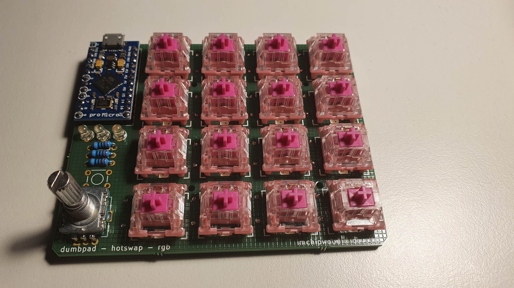
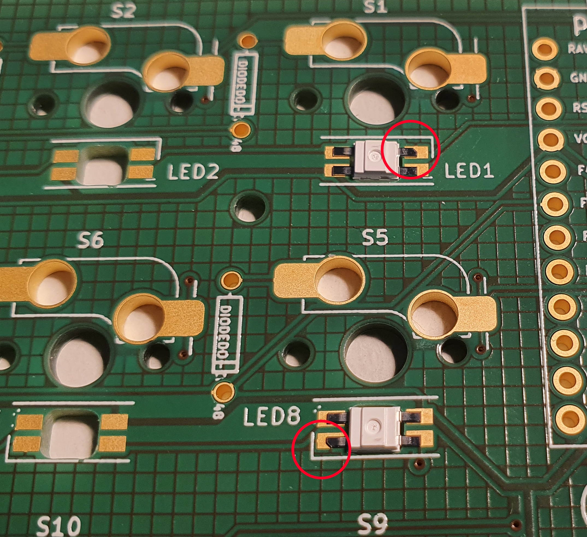

# dumbpad - Hotswap - RGB (aka v3x)

Designed by [deveth0](https://www.github.com/deveth0).

## Description

Version of the original dumbpad that features Kailh Hotswap Sockets and (optional) RGB per-key lightning.

### Revisions

- 3.1 Initial published PCB

#### dumbpad v3.1

#### Renders

### Bill of materials

- 16x Kailh Hotswap Sockets (rev 2)
- 16x Cherry-style mechanical switches
- 17x 1n4148 diodes (thru hole)
- 1x Arduino Pro Micro or pin-compatible ATmega32u4-based MCU
- 1x EC11 rotary encoder with pushbutton (7-pin)
- (optional) 16x SK6812 mini e LEDs
- (optional) 1x 6mm tactile switch (to reset MCU)
- (optional) 3x 3mm LEDs (whatever color)
- (optional) 3x 330ohm or similar resistors for the LEDS (not needed if not adding LEDs)

## Making the PCB

Submit either the KiCad `.kicad_pcb` or the gerber files to your prefered PCB manufacturer.

### Notes on soldering

It's recommended to start with the Sockets and then add the remaining parts.

Solder the SK6812 LEDs with the missing corners aligned with the corners printed on the PCB as shown in the image.

_NOTE:_ the orientation of the LEDs changes between the lines!

## Flashing Firmware

Flashing firmware should be done with [QMK Toolbox](https://github.com/qmk/qmk_toolbox)

For QMK + VIA usage, please use [dumbpad_v3x_via_firmware.hex](dumbpad_v3x_via_firmware.hex) (color changing via hardcoded keymap)

For VIAL usage, please use [dumbpad_v3x_vial_firmware.hex](dumbpad_v3x_vial_firmware.hex) (support in-app color changing and encoder mapping)

All firmware is natively support with either VIA or VIAL, your device will be discoverable by the apps.

## Acknowledgements

Some of the footprints are extracted from the awesome [Corne Keyboard](https://github.com/foostan/crkbd) by [Kosuke Adachi](https://github.com/foostan).
